# Report on lab1

## Завдання на лабораторну роботу.

### 1) Вивчити команду tree. Освоїти техніку застосування шаблону, наприклад, вивести всі файли, які містять символ с, або файли, які містять певну послідовність символів. Вивести підкаталоги кореневого каталогу до другого рівня вкладеності включно.

Спочатку я ввів команду tree -L 2 для виводу всіх підкаталогів кореневого каталогу до другого рівня

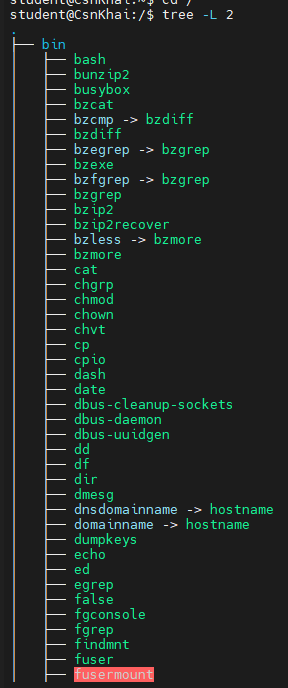

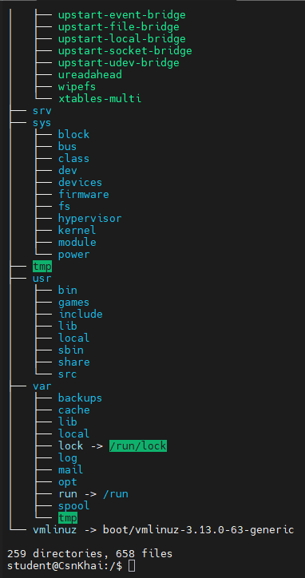

Після цього я створив у домашній директорії папку data, і в ній ще 2 папки girls, boys

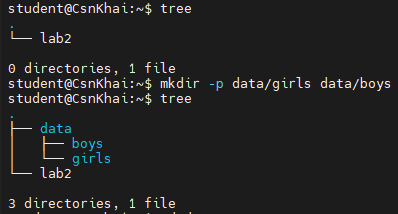

 В папці girls були створені 3 файли

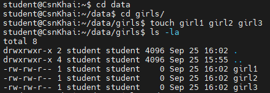

І за допомогою команди tree -P '*girl*' я знайшов ці файли знаходячись у домашньому каталозі

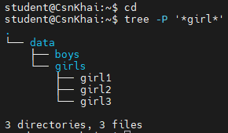


### 2) За допомогою якої команди можна визначити тип файлу (наприклад, текстовий чи бінарний)? Навести приклад.

Визначити тип файлу можна за допомогою команди find, для прикладу я створив файл lab у домашній директорії

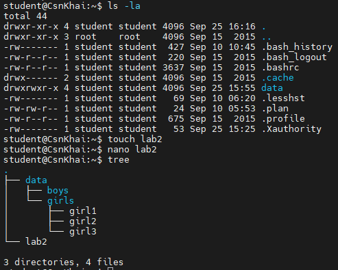

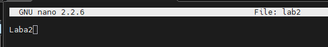

Після цього я ввів команду find, та вона написала формат цього файлу

```
student@CsnKhai:~$ file lab2
lab2: ASCII text
```


### 3) Опанувати навички навігації по файловій системі за допомогою відносних та абсолютних шляхів. Як можна повернутися до домашнього каталогу з будь-якого місця у файловій системі?

Для відносного треба лише з поточної папки

```
student@CsnKhai:~$ cd data/girls
student@CsnKhai:~/data/girls$
```

Повернутися до домашнього каталогу можна просто написавши cd
```
student@CsnKhai:~/data/girls$ cd
student@CsnKhai:~$
```

Для абсолютного шляху треба написати весь шлях від корневої папки до потрібної:

```
student@CsnKhai:~$ cd /home/student/data/girls
student@CsnKhai:~/data/girls$
```


### 4) Ознайомитись із різними ключами команди ls. Навести приклади роздруківки каталогів за допомогою різних ключів. Пояснити виведену на термінал інформацію за допомогою ключів -l та -a.

ls -a — відображає всі файли, включаючи приховані (які починаються з крапки)

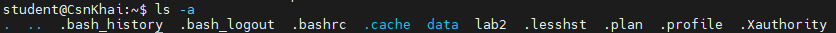

ls -l — виводить розширену інформацію про об'єкти (права доступу, кількість посилань, власника, групу, розмір у байтах, дату/час модифікації та ім'я);

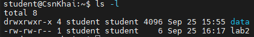

ls -la — комбінований ключ для детального відображення всіх файлів.

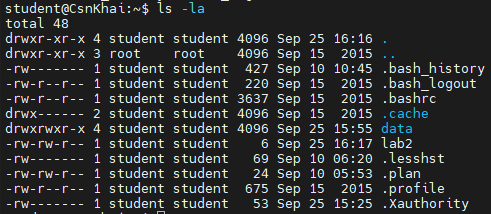


### 5) Виконати таку послідовність операцій:
- створити в домашньому каталозі підкаталог;
- у цьому підкаталозі створити файл, що містить інформацію про каталоги, що
знаходяться в кореневому каталозі (використовуючи операції перенаправлення
введення-виведення);
- переглянути створений файл;
- скопіювати створений файл у домашній каталог, використовуючи відносну та
абсолютну адресацію;
- видалити створений раніше підкаталог із файлом із запитом на видалення;
- видалити файл, скопійований до домашнього каталогу.

Спочатку у моєму підкаталозі data я створив файл dirstr в який помістив інформацію про каталоги домашньому котолозі

```
student@CsnKhai:~/data$ ls -la ../ > dirstr
```

Перевіряємо записи за допомогою команди less dirstr

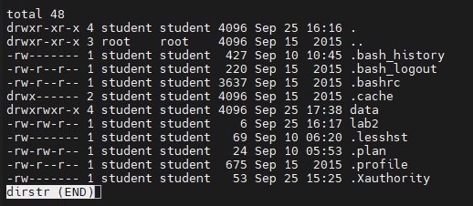

Тепер  я скопіював мій підкаталог dirstr у домашній каталог

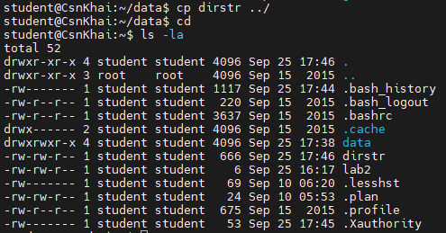

Після цього я видалив цей файл з обох каталогів

```
student@CsnKhai:~$ rm dirstr
student@CsnKhai:~$ ls
data  lab2
```

```
student@CsnKhai:~$ cd data
student@CsnKhai:~/data$ ls
boys  dirstr  girls
student@CsnKhai:~/data$ rm dirstr
student@CsnKhai:~/data$ ls
boys  girls
```


### 6) Виконати таку послідовність операцій:
- створити в домашньому каталозі підкаталог test;
- скопіювати в цей каталог файл .bash_history, змінивши його ім'я на labwork2;
- створити жорстке та м'яке посилання на файл labwork2 у підкаталозі test;
- як визначити м'яке та жорстке посилання, що означають ці поняття;
- змініть дані, відкривши символічне посилання. Які зміни відбудуться і чому?
- перейменуйте файл жорсткого посилання на файл hard_lnk_labwork2;
- перейменуйте файл м'якого посилання на файл symb_lnk_labwork2;
- потім видаліть файл labwork2. Які відбулися зміни та чому?


### 7) Використовуючи утиліту locate знайти всі файли, в яких зустрічається послідовність squid і traceroute.


### 8) Визначити, які розділи змонтовані у системі, і навіть типи цих розділів.


### 9) Підрахувати кількість рядків, що містять задану послідовність символів у заданому файлі.


### 10) Використовуючи команду find знайти всі файли в каталозі /etc, що містять послідовність символів host.


### 11) Вивести всі об'єкти каталогу /etc, що містять послідовність символів ss. Як можна продублювати аналогічну команду, використовуючи зв'язку з командою grep?


### 12) Організувати поекранну роздруківку вмісту каталогу /etc.


### 13) Які бувають типи пристроїв і як визначити тип пристрою? Навести приклади.


### 14) Як визначити тип файлу у системі, які типи файлів бувають?


### 15) Вивести перші 5 файлів каталогу, яких нещодавно здійснено доступом у каталозі /etc.
